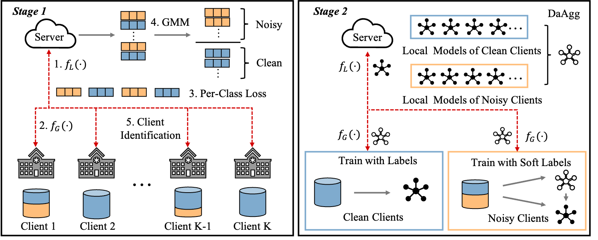

# FedNoRo
This is the official PyTorch implementation for the paper: "[FedNoRo: Towards Noise-Robust Federated Learning By Addressing Class Imbalance and Label Noise Heterogeneity](https://arxiv.org/abs/2305.05230)", which is accepted at `IJCAI'23` main track.  

<p align="center">

</p>


## Brief Introduction
This paper proposes a federated noisy label learning framework for class-imbalanced and heterogeneous multi-source medical data.


## Dataset 
Please download the ICH dataset from [kaggle](https://www.kaggle.com/c/rsna-intracranial-hemorrhage-detection) and preprocess it follow this [notebook](https://www.kaggle.com/guiferviz/prepare-dataset-resizing-and-saving-as-png). Please download the ISIC 2019 dataset from this [link](https://challenge.isic-archive.com/data/#2019). Data partition can be found in the paper.

## Requirements
We recommend using conda to setup the environment. See the `requirements.txt` for environment configuration.

## Main Baselines:
- FedAvg [[paper](http://proceedings.mlr.press/v54/mcmahan17a?ref=https://githubhelp.com)]
- FedProx [[paper](https://proceedings.mlsys.org/paper_files/paper/2020/hash/1f5fe83998a09396ebe6477d9475ba0c-Abstract.html)]
- FedLA (Logit Adjustment) [[paper](https://openreview.net/forum?id=37nvvqkCo5&utm_campaign=Weekly%20Kaggle%20News&utm_medium=email&utm_source=Revue%20newsletter)]
- RoFL [[paper](https://ieeexplore.ieee.org/abstract/document/9713942)] [[code](https://github.com/jangsoohyuk/Robust-Federated-Learning-with-Noisy-Labels)]
- RHFL [[paper](https://openaccess.thecvf.com/content/CVPR2022/html/Fang_Robust_Federated_Learning_With_Noisy_and_Heterogeneous_Clients_CVPR_2022_paper.html)] [[code](https://github.com/FangXiuwen/Robust_FL)]
- FedLSR [[paper](https://dl.acm.org/doi/abs/10.1145/3511808.3557475)] [[code](https://github.com/Sprinter1999/FedLSR)]
- FedCorr [[paper](https://openaccess.thecvf.com/content/CVPR2022/html/Xu_FedCorr_Multi-Stage_Federated_Learning_for_Label_Noise_Correction_CVPR_2022_paper.html)] [[code](https://github.com/Xu-Jingyi/FedCorr)]

## Citation
If this repository is useful for your research, please consider citing:

```shell
@inproceedings{wu2023fednoro,
  title     = {FedNoRo: Towards Noise-Robust Federated Learning by Addressing Class Imbalance and Label Noise Heterogeneity},
  author    = {Wu, Nannan and Yu, Li and Jiang, Xuefeng and Cheng, Kwang-Ting and Yan, Zengqiang},
  booktitle = {Proceedings of the Thirty-Second International Joint Conference on
               Artificial Intelligence, {IJCAI-23}},
  pages     = {4424--4432},
  year      = {2023},
  month     = {8},
  note      = {Main Track},
  doi       = {10.24963/ijcai.2023/492},
  url       = {https://doi.org/10.24963/ijcai.2023/492},
}
  ```

## Contact
For any questions, please contact 'wnn2000@hust.edu.cn'.
